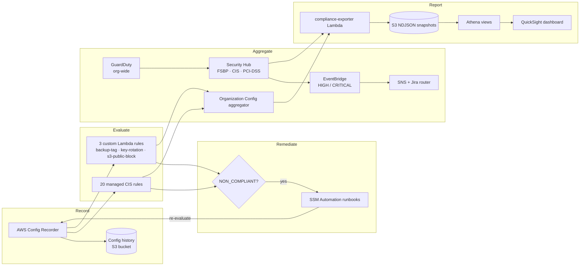

# aws-security-compliance

Continuous, organization-wide compliance for AWS. The platform records every
resource configuration with **AWS Config**, evaluates it against the **CIS AWS
Foundations Benchmark** (20 managed rules plus 3 custom Lambda-backed rules),
**auto-remediates** drift with SSM Automation runbooks, **aggregates** signal
across the organization with Security Hub and GuardDuty, and **reports** an
executive view through Athena and QuickSight.

Everything is Terraform. Adding, tuning, or retiring a control is a reviewable
one-line diff.

## Compliance flow



The loop is closed: a resource that drifts NON_COMPLIANT triggers the mapped
SSM runbook, the runbook fixes the resource, and the next Config evaluation
flips it back to COMPLIANT — usually within minutes.

## What this provides

| Capability | Implementation |
|---|---|
| Configuration recording | Config recorder + delivery channel, all supported resource types including global |
| CIS baseline evaluation | 20 AWS managed Config rules mapped to CIS AWS Foundations Benchmark controls |
| Custom guardrails | Lambda-backed Config rules: backup tagging, IAM key rotation, S3 public-access blocks |
| Auto-remediation | 3 SSM Automation runbooks wired to Config remediation configurations |
| Aggregation | Org-wide Config aggregator; Security Hub (FSBP + CIS + PCI-DSS) and GuardDuty findings routing |
| Alerting | EventBridge routes HIGH/CRITICAL findings to an SNS topic and an idempotent Jira forwarder |
| Reporting | Daily compliance snapshots to S3, partition-projected Athena views, QuickSight dashboard |

## Control matrix (summary)

The full mapping — every rule to its CIS, PCI-DSS, and SOC 2 control, plus its
remediation runbook — lives in [`docs/control-matrix.md`](docs/control-matrix.md).

| Domain | Example rules | CIS § | PCI-DSS | SOC 2 |
|---|---|---|---|---|
| Identity & access | root key absent, root/console MFA, key rotation, password policy, no `*:*` policies | 1.x | 7, 8 | CC6.1–CC6.3 |
| Data protection | S3 public read/write prohibited, S3 SSE + TLS, EBS/RDS encryption, account public-access block | 2.x | 3, 4 | CC6.1, CC6.7 |
| Logging & monitoring | CloudTrail enabled + multi-region + log-file validation, KMS key rotation, VPC flow logs | 3.x | 10 | CC7.2 |
| Networking | no SSH (port 22) from `0.0.0.0/0` | 5.2 | 1 | CC6.6 |
| Custom guardrails | `require-backup-tag`, `iam-key-rotation`, `s3-public-blocks` | — | 3, 8, 10 | CC6.1, A1.2 |

## Repository structure

```
.
├── terraform/                # All infrastructure
│   ├── config-recorder.tf    # Recorder, delivery channel, org aggregator
│   ├── managed-rules.tf      # 20 managed CIS rules (single for_each map)
│   ├── custom-rules.tf       # 3 Lambda-backed rules + IAM
│   ├── remediation-configurations.tf  # NON_COMPLIANT -> SSM runbook mapping
│   ├── security-hub.tf       # FSBP + CIS + PCI-DSS, org delegated admin
│   ├── guardduty.tf          # Detector + 6 protection features, org auto-enable
│   ├── findings-router.tf    # EventBridge -> SNS + Jira Lambda
│   ├── athena-views.tf       # Exports bucket, Glue DB, projected tables, workgroup
│   └── quicksight.tf         # Athena datasource, SPICE datasets, dashboard
├── lambda/
│   ├── config-rules/         # Custom Config rule evaluators (one dir per rule)
│   ├── compliance-exporter/  # Daily compliance snapshot -> S3 NDJSON
│   └── findings-router/      # Security Hub finding -> Jira (idempotent)
├── ssm-documents/            # SSM Automation runbooks (auto-fix)
├── tests/                    # pytest suite for the Lambda evaluators
└── docs/                     # architecture.md, control-matrix.md
```

## Getting started

```bash
cd terraform
terraform init
terraform plan -out=tfplan
terraform apply tfplan
```

Or use the [`Makefile`](Makefile): `make init`, `make plan`, `make apply`,
`make test`, `make lint`.

### Requirements

| Name | Version |
|---|---|
| terraform | >= 1.6.0 |
| aws provider | >= 5.40.0, < 6.0.0 |
| archive provider | >= 2.4.0 |
| python (custom rules / tests) | >= 3.11 |

The deploying role needs permissions for AWS Config, IAM, S3, Lambda, SSM,
Security Hub, GuardDuty, EventBridge, Athena/Glue, QuickSight, and (for the
organization aggregator and delegated-admin features) AWS Organizations access
from the delegated security/audit account.

### Key inputs

| Variable | Default | Purpose |
|---|---|---|
| `aws_region` | `us-east-1` | Region for the recorder, aggregator, and analytics |
| `enable_organization_aggregator` | `true` | Aggregate every account into the security account |
| `enable_auto_remediation` | `true` | Wire NON_COMPLIANT resources to SSM runbooks |
| `enable_securityhub_org` / `enable_guardduty_org` | `true` | Org-wide auto-enable for new accounts |
| `enable_quicksight` | `false` | Build the dashboard (needs `quicksight_principal_arn`) |
| `enable_jira_forwarder` | `false` | Forward HIGH/CRITICAL findings to Jira |

See `terraform/*.tf` `variable` blocks for the complete, validated list.

## Design notes

- **Managed rules are data, not code.** All 20 live in one `for_each` map in
  `managed-rules.tf`, each annotated with the CIS control it backs, so the
  control matrix is generated straight from the source of truth.
- **Custom rules are independently testable.** Evaluation logic is pure Python
  with boto3 isolated behind module-level clients, so the [`tests/`](tests)
  suite exercises every branch without touching AWS.
- **Remediation closes the loop.** Config remediation configurations call SSM
  runbooks under a least-privilege role with confused-deputy protection, so
  drift self-heals and the next evaluation confirms it.
- **The Config delivery bucket is never public** — versioned, SSE-encrypted,
  lifecycle-expired, and guarded by a deny-insecure-transport policy.
- **Analytics fails safe.** QuickSight and the Jira forwarder are gated behind
  feature flags, so a credential-less `terraform plan` stays clean.

## Contributing

See [CONTRIBUTING.md](CONTRIBUTING.md). In short: `make fmt lint test` must pass,
commits follow Conventional Commits, and new managed rules are added to the
`for_each` map with their CIS reference.

## License

MIT — see [LICENSE](LICENSE).
