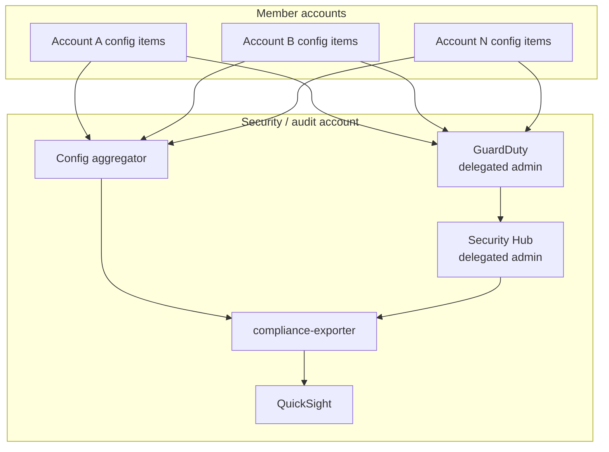

# Architecture

This document explains how `aws-security-compliance` records, evaluates,
remediates, aggregates, and reports compliance, and the design decisions behind
each stage.

## Deployment model

The platform is designed to run **once, in the organization's security/audit
account**, which is registered as the delegated administrator for AWS Config,
Security Hub, and GuardDuty. From there it has organization-wide visibility
without granting the audit account write access to member-account workloads.

## Stage 1 — Record

`terraform/config-recorder.tf` provisions the AWS Config recorder and delivery
channel. It records all supported resource types, including global resources
(IAM, CloudFront), and ships configuration snapshots to a hardened S3 bucket:

- Bucket versioning **on**, SSE **on**, and a bucket policy that **denies
  non-TLS** access and restricts writes to the Config service principal.
- A lifecycle rule expires history objects after `config_history_retention_days`.
- When `enable_organization_aggregator = true`, an aggregator pulls every
  member account's evaluations into the security account.

## Stage 2 — Evaluate

Two complementary rule sets evaluate the recorded state.

**Managed rules** (`terraform/managed-rules.tf`). Twenty AWS managed rules,
driven from one `for_each` map. Each entry names the CIS control it backs and
its evaluation frequency (configuration-change vs. periodic). Examples: root
account access-key absence (CIS 1.4), S3 SSL-only (CIS 2.1.2), multi-region
CloudTrail (CIS 3.1), no SSH from `0.0.0.0/0` (CIS 5.2).

**Custom rules** (`terraform/custom-rules.tf` + `lambda/config-rules/`). Three
Lambda-backed rules cover gaps the managed catalog does not:

| Rule | Trigger | Logic |
|---|---|---|
| `require-backup-tag` | change on EBS / RDS / EFS | resource must carry a non-empty `Backup` tag (optionally one of an allowed set) |
| `iam-key-rotation` | periodic | no IAM user may have an **active** access key older than `max_access_key_age_days` |
| `s3-public-blocks` | change on S3 buckets | all four public-access-block flags must be enabled (bucket- or, optionally, account-level) |

Each evaluator is pure Python: boto3 clients are module-level singletons, the
decision functions take plain dicts and return `(compliance_type, annotation)`,
and annotations are clamped to the 256-character `PutEvaluations` limit. This
keeps the logic unit-testable without AWS (see [`tests/`](../tests)).

## Stage 3 — Remediate

`terraform/remediation-configurations.tf` maps a NON_COMPLIANT rule to an SSM
Automation runbook under `ssm-documents/`:

| Non-compliant rule | Runbook | Action |
|---|---|---|
| `s3-public-blocks` | `enable-s3-public-block.yaml` | enable all four bucket public-access-block flags |
| `iam-key-rotation` | `rotate-iam-key.yaml` | deactivate (default) or delete aged access keys |
| `require-backup-tag` | `attach-missing-tags.yaml` | attach default tags so the resource becomes compliant |

Runbooks assume a dedicated least-privilege role with **confused-deputy
protection** (`aws:SourceAccount` condition), so only automations originating in
this account can assume it. Remediation concurrency and error thresholds are
configurable; `iam-key-rotation` defaults to the reversible *deactivate* mode.

## Stage 4 — Aggregate

- **Security Hub** (`terraform/security-hub.tf`) is enabled with the AWS
  Foundational Security Best Practices, CIS (v3.0.0), and PCI-DSS (v3.2.1)
  standards, an all-regions finding aggregator, and organization auto-enable so
  new accounts are covered automatically.
- **GuardDuty** (`terraform/guardduty.tf`) runs org-wide with six protection
  features: S3, EKS audit logs, RDS login activity, malware protection, Lambda
  network logs, and runtime monitoring. Its findings flow into Security Hub.
- **Findings router** (`terraform/findings-router.tf` + `lambda/findings-router/`)
  subscribes an EventBridge rule to HIGH/CRITICAL Security Hub findings and
  fans them out to a CMK-encrypted SNS topic and an idempotent Jira forwarder.
  The forwarder derives a deterministic dedupe label from the finding id, so a
  re-emitted finding updates rather than duplicates its ticket.

## Stage 5 — Report

`lambda/compliance-exporter/` runs on a daily EventBridge schedule. It collects
per-rule compliance (from the aggregator when present, otherwise locally) plus a
Security Hub finding summary, and writes newline-delimited JSON to a partitioned
S3 prefix (`dt=YYYY-MM-DD`). `terraform/athena-views.tf` defines a Glue database,
two partition-projected tables, an Athena workgroup, and saved
view/report queries. `terraform/quicksight.tf` (flag-gated) builds an Athena data
source, SPICE datasets with daily refresh, and an executive dashboard
(compliance-percentage KPI plus per-account and per-standard breakdowns).

## Cross-cutting decisions

- **Feature flags fail safe.** QuickSight, the Jira forwarder, and the org-level
  delegated-admin resources are all flag-gated so a minimal or credential-less
  `terraform plan` stays clean and partial deployments are first-class.
- **Least privilege everywhere.** The evaluator role is read-only; the
  remediation role is scoped per action with resource ARNs and a source-account
  condition.
- **No real account data in the repo.** Reports and scan output are
  `.gitignore`d; only documented placeholder account ids appear in examples.

## Operational runbook

| Symptom | Where to look |
|---|---|
| Rule stuck `INSUFFICIENT_DATA` | Confirm the recorder is on and the resource type is in scope |
| Remediation not firing | Check the Config remediation configuration and the SSM execution role trust policy |
| Finding not in Jira | Confirm `enable_jira_forwarder`, the secret payload (`email` + `api_token`), and the EventBridge severity filter |
| Dashboard empty | Confirm `enable_quicksight`, the exporter schedule ran, and the Athena table partitions projected |
